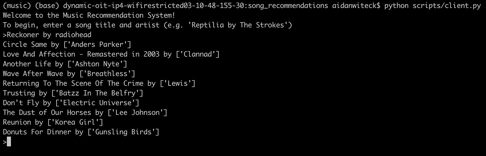

# Spotify Track Recommendation Using Locality-Sensitive Hashing
-
This repository implements LSH using randomly generated hyperplanes to perform vector search for song recommendations. The algorithm is coded up from scratch; the only notable dependencies are `pandas`, `numpy`, and `thefuzz`. For a full list of dependencies see `requirements.txt`. 

For a more in-deoth blog post about LSH and how I implemented it, see [this Medium article](https://medium.com/@awiteck/lets-discover-some-music-implementing-an-efficient-vector-search-from-scratch-in-python-384450744438) I wrote. 

## Setup and Running
The dataset used for this project can be found [here](https://www.kaggle.com/datasets/rodolfofigueroa/spotify-12m-songs/). To run the client script, ensure that `tracks_features.csv` is stored in the local path `./data/tracks_features.csv`. 

To run the algorithm, simply navigate to `track_recommendation/` and run `python scripts/client.py`. From there, the dataset will be constructed and you can enter a song. For best results, when entering the name of a song, simply write `<SONG NAME> by <ARTIST NAME>`. Here's an example: 

